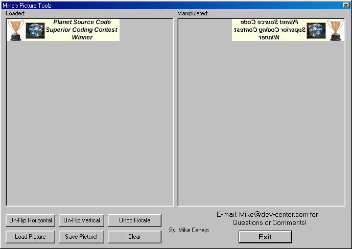



## Mike's Picture Commands

### Description

This includes the source code Loading a picture, Rotating a Picture 45 Degrees, Flipping a Picture Horizontally, Flipping a Picture Vertically and Saving it After! Very usefull if your working on your own picture program. I made a nice layout for this and Commented everything.

 Please, I worked hard on this for yous

So check it out then Rate it....

 Questions/Comments: 

AIM: Mike3dd
 
### More Info
 
RATE IT!!!!!

LoL :)

             |
---                |---
**Submitted On**   |2000-04-19 05:05:52
**By**             |[Michael L\. Canejo](https://github.com/Planet-Source-Code/PSCIndex/blob/master/ByAuthor/michael-l-canejo.md)
**Level**          |Advanced
**User Rating**    |5.0 (30 globes from 6 users)
**Compatibility**  |VB 5\.0, VB 6\.0
**Category**       |[Custom Controls/ Forms/  Menus](https://github.com/Planet-Source-Code/PSCIndex/blob/master/ByCategory/custom-controls-forms-menus__1-4.md)
**World**          |[Visual Basic](https://github.com/Planet-Source-Code/PSCIndex/blob/master/ByWorld/visual-basic.md)
**Archive File**   |[CODE\_UPLOAD49854202000\.zip](https://github.com/Planet-Source-Code/michael-l-canejo-mike-s-picture-commands__1-7406/archive/master.zip)

